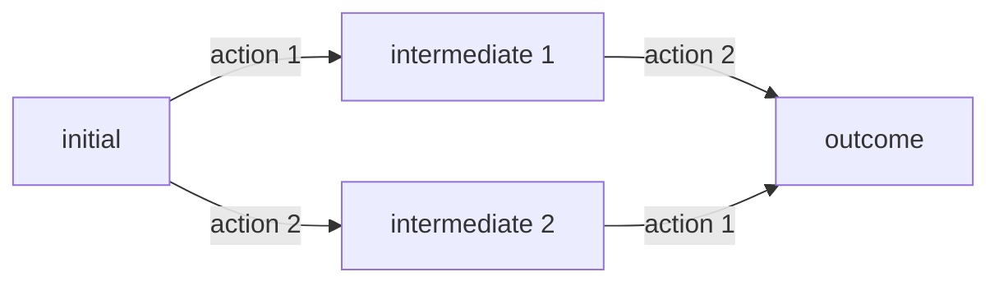

# Different paths, same destination

## Examples

- commutativity of addition (orders of operands does not matter)
- associativity of addition (independence of order)
- identity of addition (some operands do not affect results)