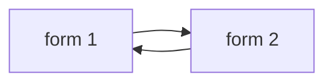

# Some things never change

```mermaid
flowchart LR
    a["form 1"]
    b["form 2"]
    a --> b
    b --> a
```

## Examples

- identity of addition (some operands do not affect results)
- list sorting (permutation)
- functor mapping (structure preservation)