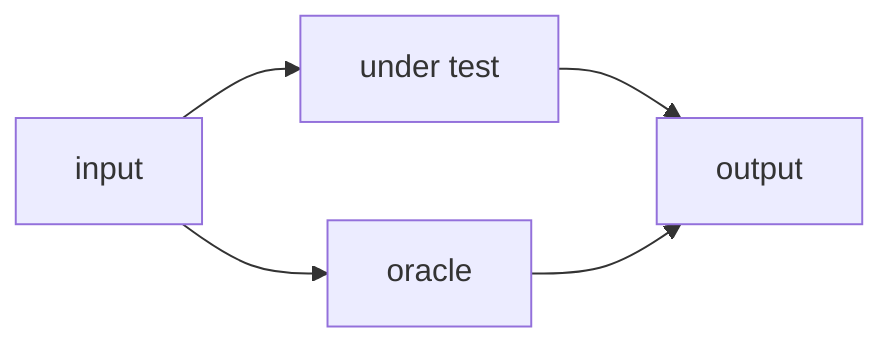

# Test Oracle

```mermaid
flowchart LR
    under_test["under test"]
    oracle["oracle"]
    input["input"]
    output["output"]
    input --> under_test
    input --> oracle
    under_test --> output
    oracle --> output
```

## Examples

- sorting algorithm optimization
- thread safety